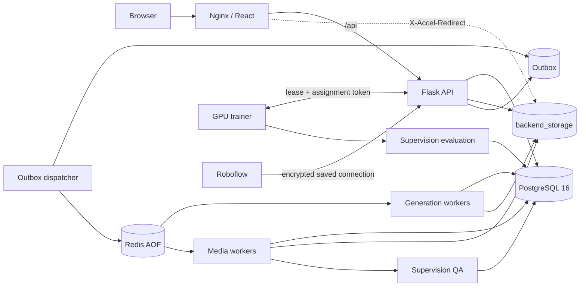

# 生产架构说明

## 设计目标

目标是小团队可维护的单机生产架构：优先保证数据正确性、任务可恢复性和可观测性，不提前引入 Kubernetes、独立对象存储或多套消息中间件。后续需要横向扩展时，存储接口和 worker 协议已经留出边界。

## 一致性边界

API 在同一个 PostgreSQL 事务内写入业务状态和 `outbox_events`。独立 dispatcher 提交 Celery 消息后标记事件已发布。dispatcher 在发送后、标记前崩溃会造成重复投递，因此消费者按以下方式幂等：

- 数据集图片由 `(dataset_id, ordinal)` 和 `(source_task_id, source_ordinal)` 唯一约束兜底。
- 生成、增强、视频编排使用 `task_items` 的单执行者租约；租约过期后可恢复。
- 导出版本由锁定 dataset row 后递增计数器分配，数据库唯一约束二次保护。
- 训练和推理用 `FOR UPDATE SKIP LOCKED` 领取，assignment token 绑定本次租约。
- 训练产物按 `(job_id, artifact_type)` upsert，worker 重试不会产生重复逻辑产物。

这套语义是 at-least-once 投递、业务效果幂等，不依赖不现实的 exactly-once 消息承诺。

## 核心数据模型

- `datasets` / `dataset_categories`：数据集和稳定类别身份。
- `assets`：文件元数据、SHA-256、存储 key 和删除状态。
- `dataset_images`：样本业务状态，关联 Asset，不再把文件路径当作唯一事实来源。
- `annotation_revisions` / `detections`：可审计标注版本；JSON 文件仅作为旧数据兼容和导出缓存。
- `dataset_tasks` / `task_items`：批次与可恢复执行租约。
- `dataset_exports`：不可变版本号和导出 Asset。
- `training_jobs` / `training_inference_jobs`：GPU worker 领取状态、租约和结果。
- `external_connections`：用户级外部服务连接；Roboflow API Key 只保存加密密文、验证状态和非敏感元数据。
- `quality_runs` / `quality_issues`：数据质检和模型评测的不可变运行记录，以及可处理、可追溯的问题样本。
- `outbox_events`：事务消息。
- `refresh_sessions`：刷新令牌 hash、轮换 family 和撤销状态。

## PostgreSQL 约定

- 主键和业务外键使用原生 UUID。
- 可检索的结构化配置使用 JSONB；金额使用 Numeric。
- 所有计数范围、置信度、bbox、版本号和 ordinal 都有检查/唯一约束。
- 连接池启用 pre-ping、回收、池等待上限，以及 statement/idle transaction timeout。
- 生产启动禁止 `db.create_all()`；Alembic 是 schema 的唯一入口。

## 存储演进

当前 `LocalStorageBackend` 使用同盘原子 rename，适合单机部署。未来切换 S3/MinIO 时，保留 `assets.storage_backend/storage_key` 和服务接口，只替换 put/open/delete/presign 实现；数据库关系和 API 不需要再次重构。

## Supervision 集成边界

Supervision 位于格式适配、质量分析和训练评测层，不取代平台的领域模型与任务系统：

- `supervision_adapter` 负责平台归一化中心框与 `sv.Detections` 的双向转换。
- ZIP 导入服务用 `DetectionDataset` 读取 YOLO、COCO、Pascal VOC，落库后仍以 `annotation_revisions` / `detections` 为事实来源。
- 导出服务从当前标注版本生成多格式数据，并用 manifest 保留平台身份，保证模型错误样本可以回流。
- 数据质检由 Celery media worker 异步执行；模型评测在 GPU trainer 内自动执行，评测 artifact 上传后由 API 转为 model 类型的质量运行。
- Roboflow 是并列的数据来源而不是 Supervision 的替代品；下载入口和 SDK 流程继续保留，凭据由 `external_connections` 管理。

## 扩展路径

达到以下阈值后再升级组件：

- 单机磁盘接近容量或需要多 API 节点：切换 S3/MinIO。
- Redis/Celery 队列延迟持续超标：按 queue 增加 worker，而非扩大单 worker 并发。
- PostgreSQL CPU/IO 持续饱和：先修慢查询和索引，再考虑托管 PG/只读副本。
- 需要零停机和节点级容灾：迁移到编排平台；现有 readiness、迁移 job 和无状态 API 可直接复用。
